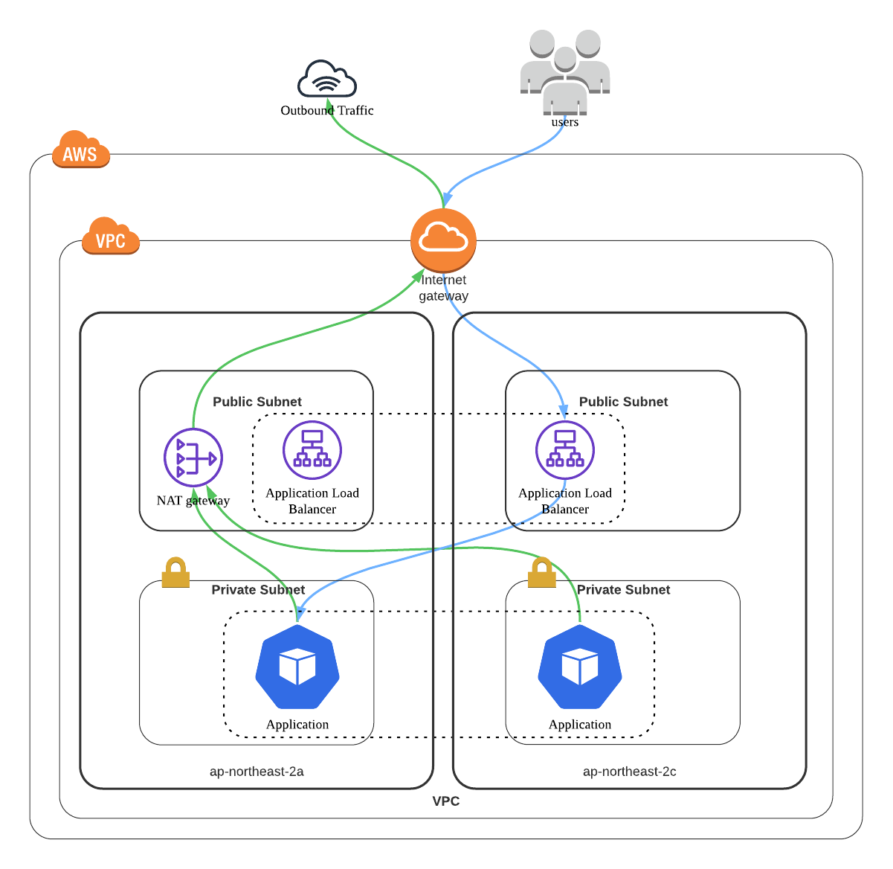
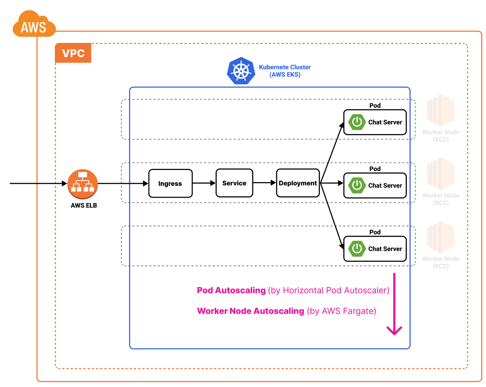

# Heart to Heart Chat Server
이 프로젝트는 `Heart to Heart` 어플리케이션의 채팅 서비스를 위한 메시징 서버입니다. `Heart to Heart` 안드로이드 어플리케이션은 [이 곳](https://github.com/yologger/heart-to-heart-android)에서 확인할 수 있습니다.

## 기술 스택
- Kotlin
- Spring Boot
- Spring WebSocket
- Spring Test
- Redis
  - AWS ElasticCache for Redis
  - Embedded Redis
- Mongo DB
  - Embedded Mongo DB
  - Firebase Cloud Messaging
- Docker
- Kubernetes (AWS EKS + Fargate)
- Helm
- Argo CD

## 아키텍처
메신저 서비스를 구성하는 요소는 크게 다음과 같습니다.

- [x] 다중 채팅 서버
- [x] 메시지 브로커
- [x] 채팅 내역 백업 스토리지
- [x] 로드 밸런서
- [x] 회원가입, 인증, 채팅이력 조회 같은 기타 API
- [ ] 푸시 알림 서버 (In Progress)

## 인프라
Terraform을 사용하여 VPC를 다음과 같이 구축했습니다. 스크립트는 [이 곳](/terraform/production/vpc.tf)에서 확인할 수 있습니다.

Kubernetes(AWS EKS, AWS Fargate) 또한 Terraform을 사용하여 구축했습니다. 스크립트는 [이 곳](/terraform/production/aws_eks.tf)에서 확인할 수 있습니다.

그 외에도 인프라 구축에 다음 기술이 적용되었습니다.
- Docker
- Kubernetes (AWS EKS)
- AWS Elastic Load Balancer(ALB)

## 기능 구현
- [x] 채팅방 관련 기능
  - [x] 채팅방 생성
  - [x] 채팅방 조회
  - [x] 채팅방 삭제
  - [x] 채팅방 입장
  - [x] 채팅방 퇴장
- [x] 채팅 메시지 관련 기능
  - [x] 채팅방 메시지 브로드캐스팅
  - [x] 채팅 메시지 저장
  - [x] 채팅 메시지 조회
- [x] 다중 채팅서버 with Redis
- [ ] 앱 미실행 시 Push Notification (Firebase Cloud Messaging)
- [ ] 채팅서버 비동기/논블로킹 런타임으로 마이그레이션
  - [ ] WebFlux WebSocket + Kotlin, Reactor(Flux, Mono) 대신 Coroutine 사용 가능한지 검토 중.
  - [ ] WebFlux WebSocket은 STOMP를 지원하지 않아 채팅방 세션관리, 브로드캐스팅을 직접 구현해야함.
  - [ ] Node.js + Socket.io 검토 예정.