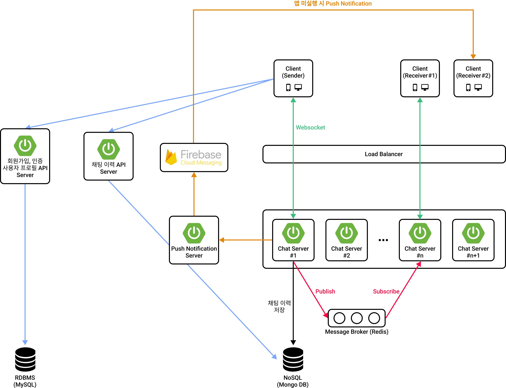
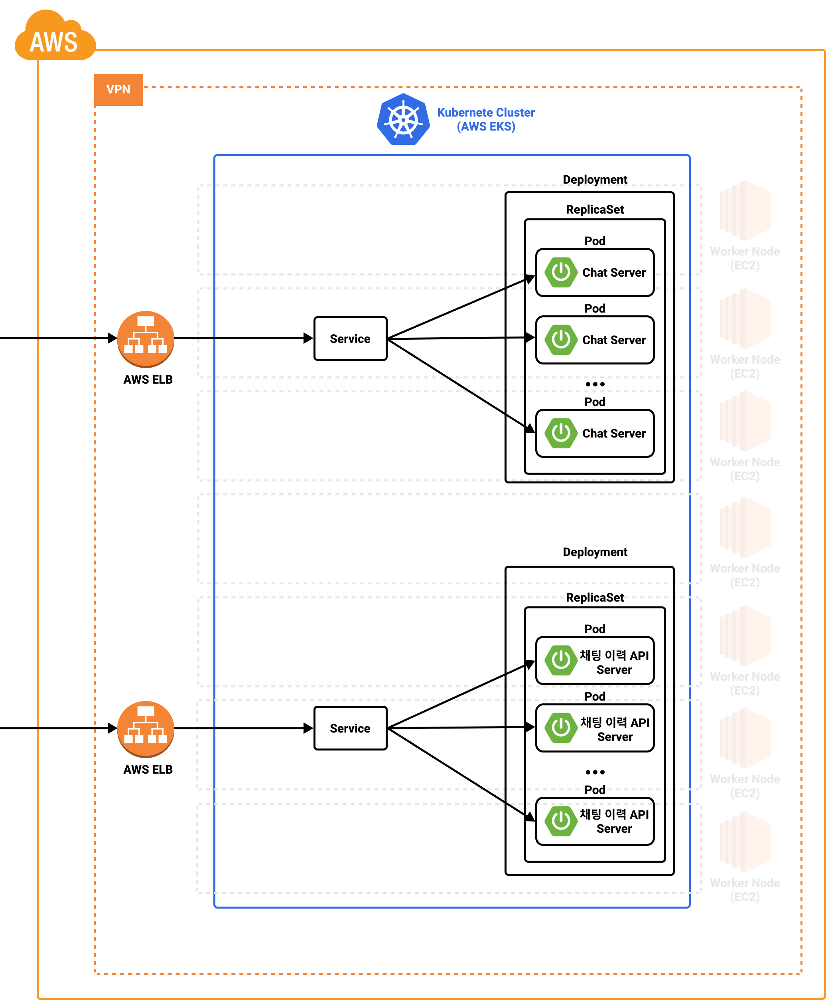

# Heart to Heart 채팅 서버
이 프로젝트는 `Heart to Heart` 어플리케이션의 채팅 서비스를 위한 메시징 서버입니다. `Heart to Heart` 안드로이드 어플리케이션은 [이 곳](https://github.com/yologger/heart-to-heart-android)에서 확인할 수 있습니다.

## 기술 스택
- Kotlin
- Spring Boot
- Spring WebSocket
- Spring Test
- AWS ElasticCache for Redis
- Embedded Redis
- Mongo DB
- Embedded Mongo DB
- Firebase Cloud Messaging

## 아키텍처
메신저 서비스를 구성하는 요소는 크게 다음과 같습니다.

- 채팅 서버
- 메시지 브로커
- 채팅 내역 백업 스토리지
- 푸시 알림 서버
- 로드 밸런서
- 회원가입, 인증, 채팅이력 조회 같은 기타 API

## 인프라

- Docker
- Kubernetes (AWS EKS)
- Argo CD
- AWS ECR
- AWS EC2
- AWS Elastic Load Balancer (NLB)
- Kustomize

## 기능
- [x] 다중 채팅 서버 with Redis
- [ ] Redis Cluster, Replication을 통한 고가용성 확보
- [x] 채팅방 생성
- [x] 채팅방 입장
- [x] 채팅방 메시지 브로드캐스팅
- [x] 채팅방 퇴장
- [x] 채팅이력 저장
- [ ] 채팅방 목록 조회
- [ ] 채팅이력 조회
- [ ] 운영 환경 구축 (AWS EKS, Kubernetes)
- [ ] CI/CD 구축 (GitHub Actions, AWS ECR, Argo CD)
- [ ] 채팅 이력 백업 
- [ ] 채팅서버 로드 밸런싱 (AWS Elastic Load Balancer)
- [ ] 앱 미실행 시 Push Notification (Firebase Cloud Messaging)
- [ ] 채팅서버 비동기/논블로킹 런타임으로 마이그레이션
  - [ ] WebFlux WebSocket + Kotlin, Reactor(Flux, Mono) 대신 Coroutine 사용 가능한지 검토 중.
  - [ ] WebFlux WebSocket은 STOMP를 지원하지 않아 채팅방 세션관리, 브로드캐스팅을 직접 구현해야한다.
  - [ ] Node.js + Socket.io 검토 예정.