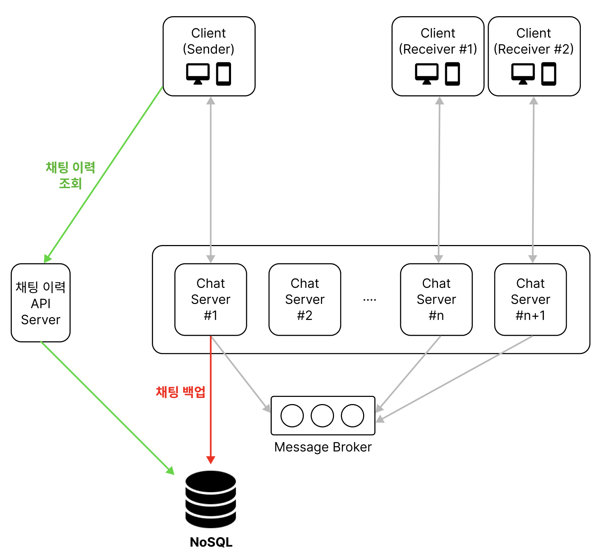
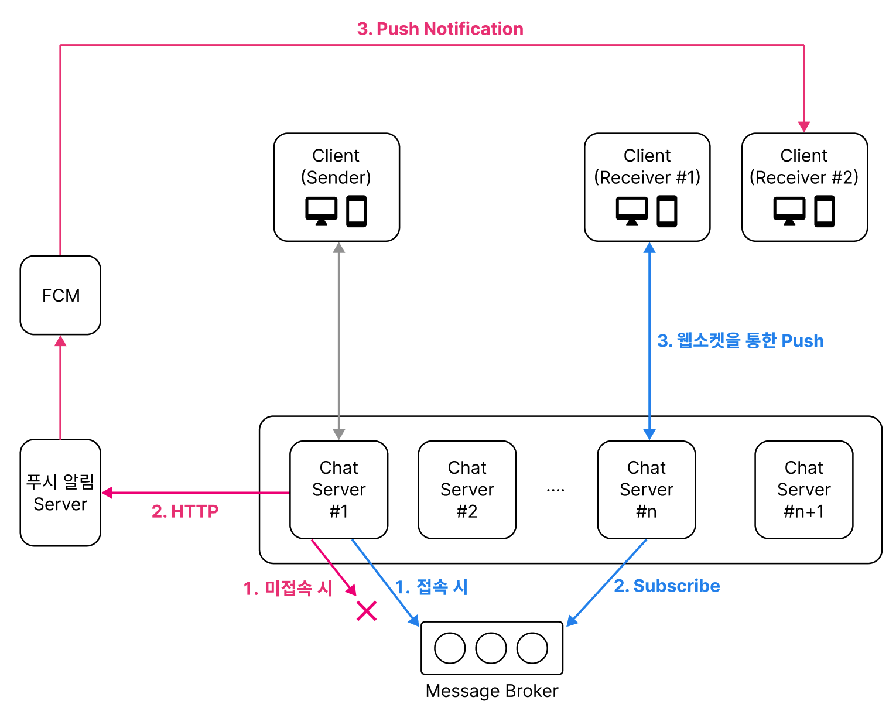
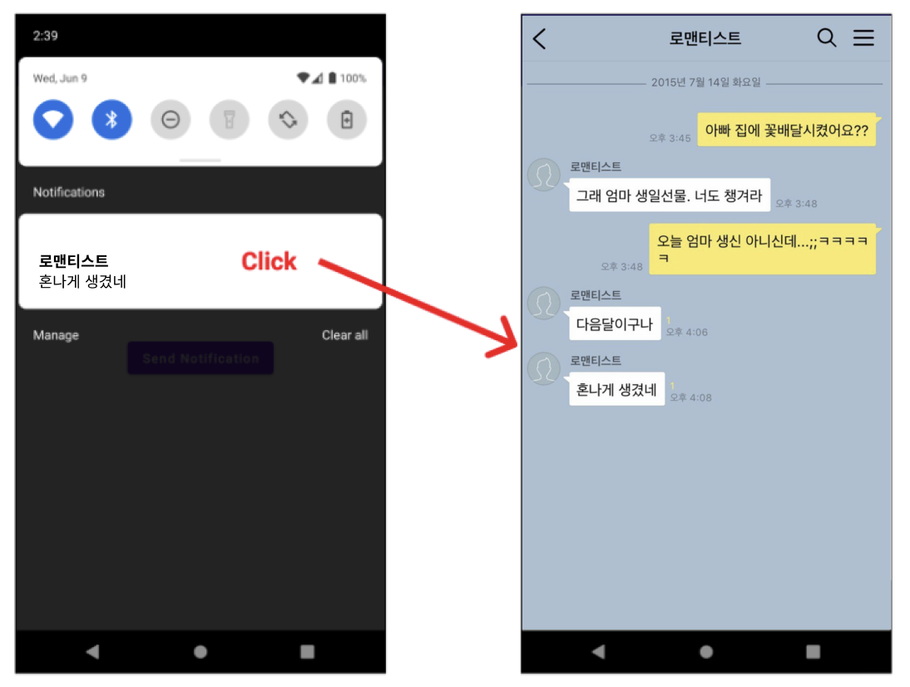
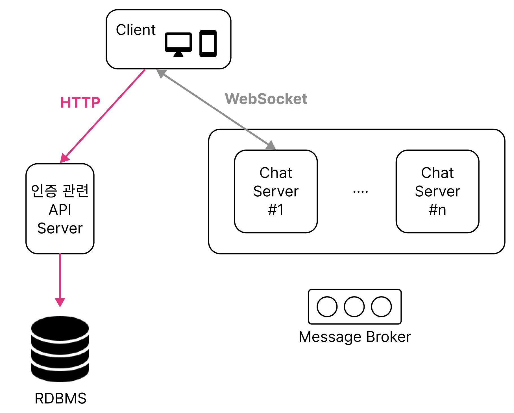

# Heart to Heart API Server
이 프로젝트는 `Heart to Heart` 어플리케이션의 채팅 서비스를 위한 메시징 서버입니다. `Heart to Heart` 안드로이드 어플리케이션은 [이 곳](https://github.com/yologger/heart-to-heart-android)에서 확인할 수 있습니다.

## 기술 스택
- Kotlin
- Spring Boot
- Spring WebSocket
- Spring Test
- Redis
- MySQL
- AWS EC2
- AWS ElasticCache for Redis
- Firebase Cloud Messaging
- Docker
- Kubernetes
- Kustomize
- Argo CD

## 아키텍처
메신저 서비스를 구성하는 요소는 크게 다음과 같습니다.

- 채팅 서버
- 메시지 브로커
- 채팅 내역 백업 스토리지
- 푸시 알림 서버
- 로드 밸런서
- 회원가입, 인증, 채팅이력 조회 같은 기타 API

## 채팅 서버
채팅 서버는 웹소켓 서버를 사용하여 구축할 수 있습니다.
### WebSocket
`웹소켓(WebSocket)`은 클라이언트와 서버 사이의 양방향 통신을 지원하는 프로토콜입니다. 스프링부트 프로젝트에서 웹 소켓을 사용하려면 다음 의존성을 추가해야합니다.
``` groovy
// build.gradle
dependencies {
    implementation 'org.springframework.boot:spring-boot-starter-web'
    implementation 'org.springframework.boot:spring-boot-starter-websocket'
}
```
그 다음 인터페이스 `WebSocketHandler`의 구현체를 구현합니다. 이 구현체에는 웹소켓 세션 연결, 종료, 메시지 수신 시 호출되는 콜백을 오버라이드합니다.
```kotlin
@Component
class MessageHandler constructor(
    @Autowired private val objectMapper: ObjectMapper
): TextWebSocketHandler() {
    override fun afterConnectionEstablished(session: WebSocketSession) {
        super.afterConnectionEstablished(session)
        // 연결 수립 후 채팅방 객체에 session id 저장
    }

    override fun handleTextMessage(session: WebSocketSession, message: TextMessage) {
        session.sendMessage(TextMessage("Echo: ${chatMessage.payload}"))
    }

    override fun afterConnectionClosed(session: WebSocketSession, status: CloseStatus) {
        super.afterConnectionClosed(session, status)
        // 연결 해제 후 채팅방 객체에서 session id 제거
    }
}
```
클라이언트와의 연결이 수립되면 서버는 `WebSocketSession` 객체를 메모리에 유지합니다. 이 객체에는 고유한 세션 ID와 클라이언트 정보 등이 저장되어있으며, `sendMessage()` 메소드로 클라이언트에게 메시지를 전송할 수도 있습니다.

이 구현체를 스프링 컨테이너에 빈으로 등록합니다.
```kotlin
@Configuration
@EnableWebSocket
class WebSocketConfig constructor(
    @Autowired private val messageHandler: MessageHandler
): WebSocketConfigurer {

    override fun registerWebSocketHandlers(registry: WebSocketHandlerRegistry) {
        registry.addHandler(messageHandler, "/message")
    }
}
```
### 채팅방
메시징 서비스는 채팅방이라는 개념이 있습니다. 채팅방을 위한 데이터 클래스를 정의하고 1:N 관계로 `WebSocketSession` 객체를 유지하면 같은 채팅방에 있는 클라이언트에게 메시지를 브로드캐스팅 할 수 있습니다.
```kotlin
data class ChatRoom(
    val roomId: String,
    val name: String,
    val sessions: Set<WebSocketSession>
) {
    public fun sendMessage(message: TextMessage) {
        for (session in sessions) session.sendMessage(message)
    }
}
```

### 채팅 메시지 
채팅 메시지를 위한 데이터 클래스는 다음과 같습니다.
```kotlin
data class ChatMessage(
    val type: MessageType,
    val roomId: String,
    val sender: String,
    val message: String
) {
    // 채팅 메시지 타입에 따라 다른 처리가 필요
    enum class MessageType {
        ENTER, MESSAGE, EXIT  // 채팅방 입장, 채팅 메시지, 채팅방 퇴장
    }
}
```
웹 소켓 핸들러는 다음과 같이 수정합니다.
```kotlin
@Component
class MessageHandler constructor(
    @Autowired private val objectMapper: ObjectMapper
): TextWebSocketHandler() {
    override fun afterConnectionEstablished(session: WebSocketSession) {
        super.afterConnectionEstablished(session)
        // 연결 수립 후 채팅방 객체에 session id 저장
    }

    override fun handleTextMessage(session: WebSocketSession, message: TextMessage) {
        val chatMessage = objectMapper.readValue(message.payload, ChatMessage::class.java)
        // 메시지 타입에 따라 다른 처리 필요
    }

    override fun afterConnectionClosed(session: WebSocketSession, status: CloseStatus) {
        super.afterConnectionClosed(session, status)
        // 연결 해제 후 채팅방 객체에서 session id 제거
    }
}
```
채팅 서버 구축과 관련된 추가 고려사항은 다음과 같습니다
- STOMP
- 비동기/논블로킹 런타임
- Server Sent Event

#### STOMP

Spring MVC를 사용하는 경우 `STOMP` 프로토콜을 ****사용하면 메시지 포맷팅, 채팅방 관리, 브로드캐스팅을 좀 더 쉽게 구현할 수 있습니다. 클라이언트에서도 다음과 같은 STOMP Client 라이브러리를 사용해야합니다.

- Web - [socket.js](https://github.com/sockjs/sockjs-client)
- android - [StompProtocolAndroid](https://github.com/NaikSoftware/StompProtocolAndroid)
- iOS - [StompKit](https://github.com/mobile-web-messaging/StompKit)

#### 비동기/논블로킹 런타임

메신저 서비스의 요청은 포맷 자체는 단순하고 요청량이 많다는 특징이 있습니다. 따라서 비동기/논블로킹 런타임 도입을 검토해볼 수 있습니다.

먼저 비동기/논블로킹 런타임으로 `Spring WebFlux`를 고려할 수 있습니다. 특히 Spring WebFlux를 Kotlin, Coroutine, suspend 함수와 함께 사용하면 Mono, Flux로 요청과 응답을 래핑하지 않아도 되기 때문에 코드가 간결해집니다. 다만 WebFlux는 STOMP를 지원하지 않기 때문에 세션 관리를 직접 구현해야합니다. 또한 DB I/O, 네트워크 통신 또한 비동기적으로 처리하는 것이 매우 중요하며, 다음과 같은 라이브러리를 사용할 수 있습니다.

- Spring Data R2DBC
- Spring Data Mongo Reactive - ReactiveMongoTemplate, ReactiveMongoRepository
- Spring Data Redis Reactive - ReactiveRedisTemplate
- WebClient
- OkHttp3
- Retrofit2

비동기/논블로킹 런타임으로 `Node.js`를 사용하는 경우 `socket.io`를 사용하여 웹소켓 서버를 구축할 수 있습니다. socket.io는 채팅방 관리, 브로드캐스팅을 지원하며 다음과 같은 클라이언트 라이브러리도 함께 제공합니다.

- Web - [socket.io-client](https://github.com/socketio/socket.io-client)
- Android - [socket.io-client-java](https://github.com/socketio/socket.io-server-java)
- iOS - [socket-io.client-swift](https://github.com/socketio/socket.io-client-swift)

#### Server Sent Event
채팅 서버로 웹소켓 대신 `SSE(Server Sent Event)`를 고려해볼 수도 있습니다.


웹소켓을 사용할 경우 클라이언트는 연결 수립 후 지속적인 핸드쉐이킹이 필요로 합니다. 반면 SSE을 사용하는 경우 클라이언트는 리스너만 개방해두면 되기 때문에 베터리와 데이터 전송량이 중요한 모바일에서 좀 더 효율적이라고 알고 있습니다. 그 외에도 gRPC와 gRPC Streaming도 고려할 수 있습니다.

## 채팅 이력 백업
채팅 서비스는 채팅방 접속 시 이전 채팅 이력도 제공해야하기 때문에 메시지 보관이 필수입니다. Apache Kafka는 발행한 메시지를 Partition이라는 디스크 공간에 저장해줍니다. 반면 Redis는 메모리만 사용하여 단순히 전달만 하기 때문에 별도의 스토리지에 채팅 이력을 저장해야합니다.



채팅 이력 저장소로는 MongoDB 같은 NoSQL을 사용할 수 있으며, 다음과 같은 장점을 가지고 있습니다.

- 데이터 구조가 자유롭다. 따라서 구조가 복잡하진 않지만 대용량 데이터를 빠르게 처리해야하는 메신저 서비스, 빅데이터 등에 활용할 수 있다.
- RDBMS에 비해 샤딩, 레플리케이션과 수평정 확장이 수월하다.
- 많은 비동기/논블로킹 런타임이 NoSQL에 대한 비동기 I/O를 지원한다.

이 외에도 이전 채팅 이력을 조회할 수 있는 REST API를 제공해야합니다.

## Push Notification
수신자가 접속하지 않아 웹소켓 세션이 없는 경우, 푸시 알림을 통해 메시지를 전송해야합니다. 이를 위해 푸시 알림 서버도 구축해야합니다. 푸시 알림을 위해 서드 파티인 FCM(Firebase Cloud Messaging)를 사용할 수 있으며, 푸시 알림 앱을 FCM에 등록한 후 HTTP 통신을 통해 푸시 알림 전송을 요청할 수 있습니다.



안드로이드 앱의 경우 푸시 알림을 클릭하면 해당 채팅방과 관련된 액티비티를 론치하도록 구현할 수 있습니다. 이 때 채팅 이력을 조회하여 UI에 렌더링하면 됩니다.



## 기타 기능
회원가입, 로그인, 인증, 사용자 프로필 조회 및 업데이트와 같은 기능은 ACID를 보장하는 RDBMS가 적합합니다. 이 기능들은 별도의 REST API를 구축하여 제공할 수 있습니다.

